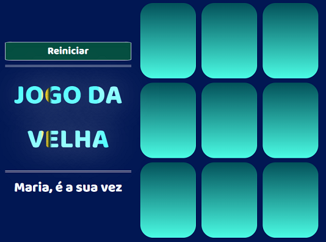

### Refatorando, personalizando e implementando a responsividade no Jogo da Velha.

# Sk8 Tic Tac Toe

### Projeto "Criando seu próprio jogo da velha com HTML e Javascript"
### Bootcamp "Órbi Web Games Developer"
### Digital Innovation One

## SITE TOTALMENTE RESPONSIVO

Refatorando, personalizando e implementando a responsividade total no projeto ["Criando seu próprio jogo da velha com HTML e Javascript"](https://web.dio.me/project/criando-seu-proprio-jogo-da-velha-com-html-e-javascript/learning/77459b5a-ef9a-4b9f-8806-e76e00a84a97?back=/track/orbi-web-game-developer&tab=undefined&moduleId=undefined) do Bootcamp ["Órbi Web Games Developer"](https://web.dio.me/track/orbi-web-game-developer) da DIO.

O projeto original foi refatorado e personalizado assim como implementadas a responsividade total e outras funcionalidades como a tela inicial e a aleatoriedade para se escolher o jogador inicial. Também foram corrigidos problemas de limpeza, ordenação e organização das classes no css, do script e das tags html para melhor apresentação do código, assim como foram acrescentados comentários em cada elemento com uma breve descrição de sua função no script e no css com a mesma finalidade.

 PODE SER UTILIZADO EM SMARTPHONES NÃO IMPORTA A ORIENTAÇÃO.

Sites ferramentas:
- [icon archive](https://iconarchive.com/) "favicon"
- [google fonts](fonts.google.com) "fontes online"
- [netlify](netlify.com) "hospedagem gratuita do site"
- [dio](web.dio.me) "aprendizado"
- [google](google.com) "pesquisa"
- [stackoverflow](https://pt.stackoverflow.com/) "pesquisa"
- [online image editor](https://www.online-image-editor.com/?language=portuguese) "edição das imagens"

Site Hospedado do Projeto Personalizado: [Sk8 TicTacToe](https://sk8-tictactoe.netlify.app/)

[RASCUNHO DO PROJETO](https://github.com/CHCLopes/Jogo-da-Velha---Rascunho)